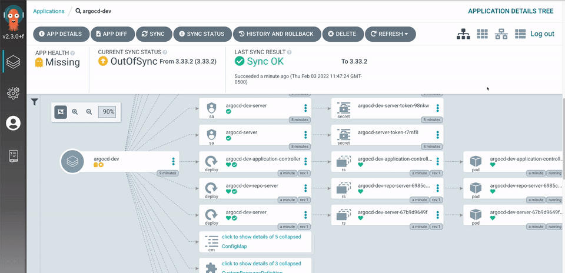

# Steps to Run ArgoCD

## 1. Install ArgoCD

You can install ArgoCD by running:
```
kubectl create namespace argocd
kubectl apply -n argocd -f https://raw.githubusercontent.com/argoproj/argo-cd/stable/manifests/install.yaml

```
This installs ArgoCD in your Kubernetes cluster.

## 2.Access the ArgoCD UI

Once installed, you can access the ArgoCD UI using port-forwarding or by exposing the service externally:

```
kubectl port-forward svc/argocd-server -n argocd 8080:443
```
Open a browser and visit `https://localhost:8080`. You might need to accept the self-signed certificate to proceed.

## 3. Login to ArgoCD

Use the default username and password to login:

```
Username: admin
Password: <retrieve admin password>
```
You can retrieve the admin password using:

```
kubectl -n argocd get secret argocd-initial-admin-secret -o jsonpath="{.data.password}" | base64 -d && echo
```
These steps will get you started with running ArgoCD.

